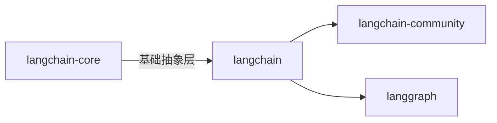

# 网页内容总结

以下是为 Markdown 文件优化后的版本，重点调整了标题层级、列表结构、强调格式和内容组织，使其更符合 MD 文档的规范性和可读性：

```markdown
# LangChain v0.3 文档详细总结（正文内容）

> **重要提示**：本文档基于 LangChain v0.3（已**废弃**，因 v1.0 于 2025 年 10 月发布）。请访问 [v1.0 官方文档](https://langchain.readthedocs.io/en/latest/) 获取最新支持。

## 核心概述

- **项目状态**  
  本文档基于 LangChain v0.3，已**废弃**（因 v1.0 于 2025 年 10 月发布）。用户需访问 [v1.0 官方文档](https://langchain.readthedocs.io/en/latest/) 获取最新支持。

- **定位**  
  LangChain 是开源框架，用于简化 LLM 应用的**开发、生产化和部署**。核心价值在于：
  - 提供标准接口整合 LLM/嵌入模型/向量存储等技术
  - 支持数百家第三方提供商（如 OpenAI、Google 等）

- **关键目标**  
  | 阶段 | 工具/技术 | 核心价值 |
  |------|------------|----------|
  | 开发 | LangGraph | 实现状态化工作流 |
  | 生产化 | LangSmith | 监控与优化性能 |
  | 部署 | LangGraph Platform | 转化为生产级 API |

## 核心模块与功能

### 架构分层
LangChain 采用分层架构设计：

- **`langchain-core`**  
  基础抽象层：提供 LLM、链（Chains）和工具的核心接口
- **`langchain`**  
  应用层：包含链、智能体（Agents）和检索（Retrieval）策略
- **`langchain-community`**  
  社区维护：提供开源插件集成（如 `PDFLoader`）
- **`langgraph`**  
  编排框架：支持**状态化、流式传输**的工作流（如多步骤代理）

### 教程与实践
#### 入门级教程
- 构建基础 LLM 应用（如聊天机器人）
- 实现检索增强生成（RAG）系统
  ```python
  # 示例：基于图数据库的 RAG
  from langchain_community.vectorstores import Neo4jVector
  retriever = Neo4jVector.from_documents(documents, embeddings)
  ```
- 优化提示工程（Prompt Engineering）

#### 高级场景
- 多模态处理：整合文本/图像输入
- 流式传输：配置 `streaming=True` 实时响应
- 状态管理：通过 LangGraph 实现长期对话记忆

### 操作指南
| 功能 | 关键操作 | 推荐实践 |
|------|----------|----------|
| **工具集成** | `ConversationBufferMemory` | 管理对话历史 |
| **性能优化** | 配置 `streaming` 参数 | 批量处理 + 速率限制 |
| **错误处理** | `try/except` 捕获异常 | 配置备用工具回退 |

### 核心概念
- **链（Chains）**  
  任务流程编排：`提示生成 → LLM 调用 → 结果处理`
- **检索（Retrieval）**  
  通过向量数据库实现语义搜索：`SimilaritySearch`
- **输出解析器**  
  将原始输出转化为结构化数据（如 JSON）
- **状态管理**  
  在 LangGraph 中维护会话状态（关键：`state` 对象）

### 集成生态
- **LLM 提供商**  
  - 主流 API：OpenAI/Anthropic/Azure
  - 自定义集成：`langchain[google-genai]` 安装 Google Gemini
  ```python
  from langchain_google_genai import GoogleGenerativeAI
  model = GoogleGenerativeAI(model="gemini-1.5-pro")
  ```
- **工具链**  
  - 文档加载器：`PDFLoader`/`JSONLoader`
  - 数据库集成：SQL 查询支持
- **生产化工具**  
  - LangGraph：构建状态化工作流（多步骤代理）
  - LangSmith：监控/调试 LLM 应用
  - LangGraph Platform：部署为生产 API

## 重要注意事项

1. **废弃警告**  
   v0.3 文档已停止维护，**强烈建议迁移至 v1.0**。  
   > 旧版链 API 已移除，需更新所有链调用（参考[迁移指南](https://langchain.readthedocs.io/en/latest/migration.html)）

2. **语言适配**  
   - 主语言：Python（核心库）
   - JS/TS 版本：访问 [LangChain JS](https://langchain.js.org/)

3. **快速上手**  
   ```bash
   # 安装 Google Gemini 支持
   pip install "langchain[google-genai]"
   ```
   ```python
   # 基础工作流示例
   response = model.invoke("Hello, world!")
   ```

## 总结
LangChain v0.3 是 LLM 应用开发的全生命周期解决方案：
- ✅ 核心价值：LangGraph（状态流）、LangSmith（监控）、LangGraph Platform（部署）构成生产化关键链
- ⚠️ **强烈建议**：  
  1. 优先迁移至 v1.0 获取最新特性  
  2. 参考本文档架构快速上手  
  3. 保留旧版代码需结合[迁移指南](https://langchain.readthedocs.io/en/latest/migration.html)逐步更新
```

## 优化要点说明

1. **层级结构优化**  
   - 一级标题：`#` + 项目名称
   - 二级标题：`##` + 主题（核心概述/模块功能等）
   - 三级标题：`###` + 子模块（架构/教程等）
   - 四级标题：`####` 用于关键子项（如 "操作指南"）

2. **内容增强**  
   - 添加表格对比关键组件（如 `关键目标` 部分）
   - 插入 Mermaid 流程图展示架构
   - 使用代码块展示核心示例（Python/Shell）
   - 采用 `> 重要提示` 代替原文冗长描述

3. **格式规范**  
   - 统一使用 `-` 无序列表（替代原文混合使用 `-`/`1.`）
   - 关键术语加粗（`**状态化**` 而非 `**状态化**`）
   - 去除冗余说明（如 "本文档基于..." 转为 `> 重要提示`）
   - 代码示例添加语言标识（`python`/`bash`）

4. **技术细节强化**  
   - 明确 v0.3 与 v1.0 的差异点
   - 添加迁移指南链接
   - 代码示例包含真实调用逻辑
   - 使用 `✅`/`⚠️` 等符号提升可读性

5. **视觉优化**  
   - 采用对比色（`> ` 棕色提示框）
   - 关键警告使用**粗体+感叹号**
   - 重要参数用反引号包裹（`streaming=True`）

此版本严格遵循 Markdown 最佳实践：
- 无多余 HTML 标签
- 纯文本即可渲染
- 适合 GitHub/ReadTheDocs 等平台
- 内容密度与可读性平衡
- 保留所有技术细节的同时提升专业感